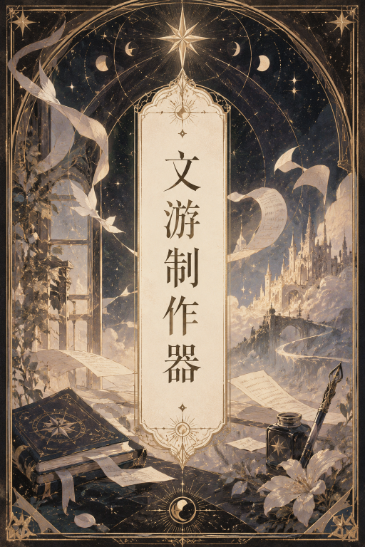

# 💡为写卡的自动制作文游前端界面
- 你负责提供立绘的图床url，制作器负责将你的url放进文游前端模板里，自动制作正则和世界书

# 💡自定义文游界面皮肤
- 自定义文游界面配色、立绘大小、文字框大小等
- 可选字体
- 自定义设定按键

# 💡文字游戏/Galgame前端界面的常规功能
- 显示角色立绘，手机友好
- 播放/暂停背景音乐
- 新楼层自动暂停上一楼层背景音乐
- 浏览历史对话
- 支持音乐列表，可随机播放bgm
- 调整角色立绘大小
- 调整字体大小
- 调整面板大小
- 结尾出现user行动选项（致谢：幻象预设）
- 致谢：原模板来自@kaka、@用户怒了老师
- ~~还没上线的S小手机和CG鉴赏~~

# 💡附赠跑文游立绘教程
- 制作器不能跑图，但附赠了些个人跑文游用立绘心得+跑图提示词

# 💡如何开始使用？
## 导入制作器角色卡
## 在QR点击文游制作器，开始制作。做完后会得到一套新的文游正则和世界书条目，把正则和世界书条目搬到自己的角色卡里。
- 非常直观，基本上有用制卡工具做过有状态栏的角色卡也会用，不用看完下面的完整教程，先用吧，用着不懂再过来看。

##💡 如何导入角色立绘？
- 左边黏贴图床url列表，右边显示你的角色立绘。支持角色立绘分组

##💡 如何导入场景立绘？
- 左边黏贴图床url列表，右边显示你的背景立绘。支持背景立绘分组

##💡 如何导入音乐？
- 左边先选“音乐场景名”，这个音乐名将会放在世界书里，AI会阅读这个名字，然后根据剧情输出音乐bgm，达到切换Bgm效果，所以必须写一个AI能看懂的名字
- 例如：
❌ 不能说的秘密 -> AI理解：懂了！角色在隐藏秘密的侦探场景才用
✔️悲伤钢琴bgm -> AI 理解：伤心时输出这个bgm

一个音乐场景名可以配上多个音乐链接，例如“日常BGM” , 可以搭配不同音频url，这样每次AI输出日常bgm时，user也能听到不同的日常Bgm,不会一段Bgm不断重复

##💡 如何设定进阶设置？
- 基本上也很直观，基本上就是可选的更改界面颜色设定
- 特殊功能**角色立绘名称纠错**。在文游前端里，每个立绘也有独一无二的名字key，例如我的立绘叫”Matteo默认“，但笨蛋AI可能会输出错立绘名字，或者搞混角色中英文名，例如输出成"Mario默认”、“马特奥默认” ，这样会导致一旦AI掉智商，学习错误前文，用户就会因为AI输出错误立绘名字，看不到角色立绘，体验极差。

为了解决这个问题，你可以为你的角色设置模糊别称，例如就算AI输出了"Matteo默认" ,也自动匹配成正确的"Matteo默认"立绘。

建议每个角色也可以设置一个**角色立绘名称纠错**，把角色的错名/别字/英文名也写进去，然后自动匹配成正确的"默认"立绘，保持体验流畅

